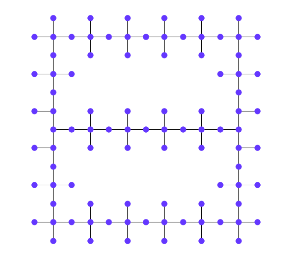
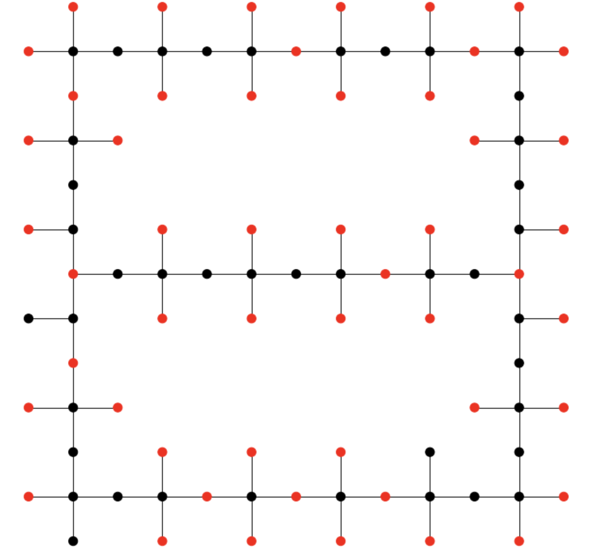

# Hi! We are the IsaacChuangFansClub team!

---

# Problem

Find Maximum Independent State of graphs that constructed by repetition of small 3*N graphs (like the one we used) while trying to be in the lowest energy state.

# Approach 

The idea we used in the challenge was to encode the MIS solution into the ground state of Hamiltonian. Next, we used the quantum adiabatic algorithm (QAA), Rydberg blockade, to evolve simple Hamiltonian to desired complicated Hamiltonian. The issue we experienced that the points betweeen the intersetion was under the influence of 4 sources of energy, which in often cases resulted that they were in grounded state, when needed to get in Rydberg state. We solved this isssue by calculating more optimal parameters for our graph. In particular, we increased the delta_final value whichi resulted in a smaller Blockade Radius. Our team used Cubic Spline transformation which made amplitude and detuning values change smoothier over the time which increased the accuracy. At the end, we used these values in Adionbatic annealing algorithm which increased delta value from negative to positive and mixed various states of vertices transforming the ones we need from 0 to 1. 

## Graph design
On the picture below one can find the graph structure we have used in the challenge in order to maximize the number of independent sets. The way the pattern is created is by multiplying the building block element depicted in the next figure. 

### Other graphs we've looked into

## Blockade radius optimization

## Pulse Optimization

# Results
The result of running the demonstration algorithm with the enhanced parameters is presented below.

|Variable|Quantity|
|:----|----:|
|Nshots|80|
|Size of Maximum independent set|51|
|Total number of nodes|93|

{width=60%}

{width=60%}
